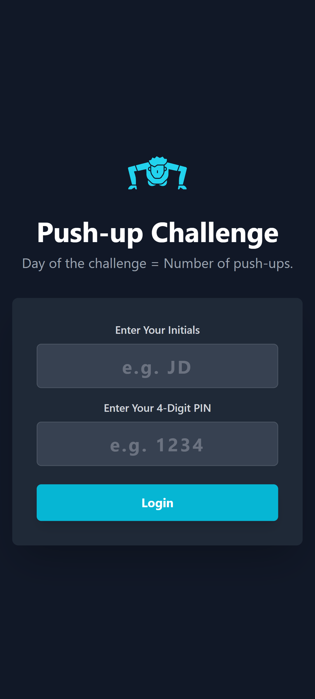
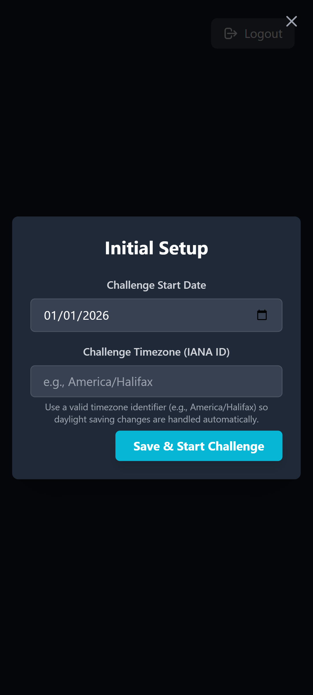
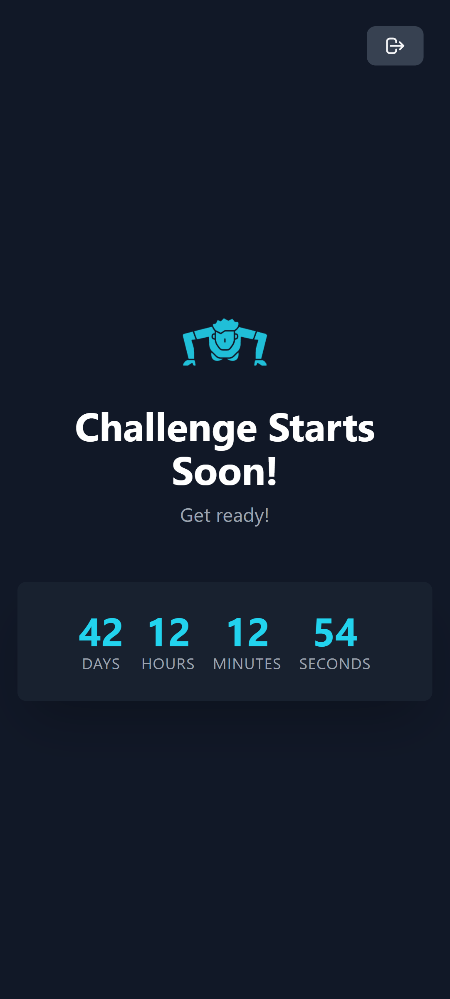
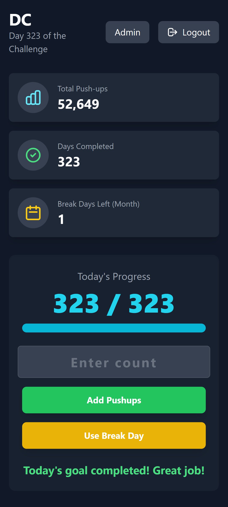
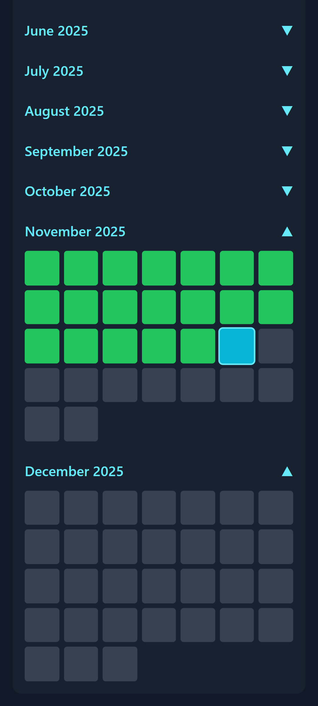
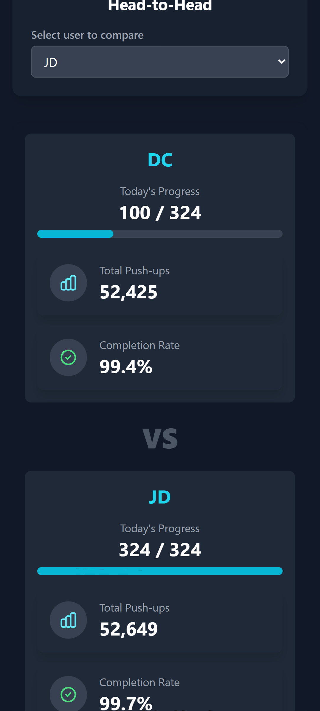
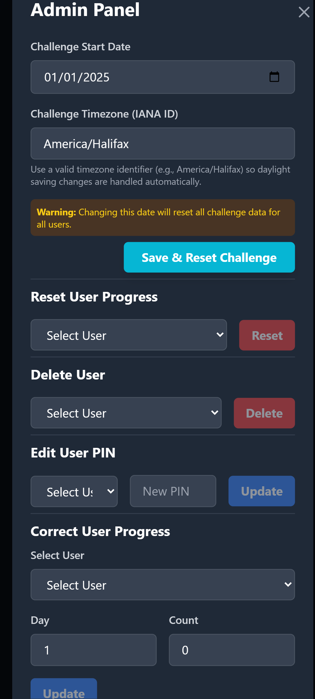

# Push-up Challenge Tracker


Track a 365-day progressive push-up challenge with per-user PINs, break-day management, and transparent progress sharing. The app is built with React + Vite on the client and an Express + SQLite API so you can self-host the entire experience without any external services.

## Features

- Multi-user login secured behind lightweight PINs.
- Challenge-day countdown, daily goal calculator, and break-day usage guardrails.
- Admin tools to configure the challenge start date and correct user progress.
- Persistent storage via SQLite (`pushup_challenge.db`) with automatic bootstrapping.
- Ready-to-run Dockerfile and Compose setup for single-command deployments.
- Challenge timezone is configured once during setup and stored in SQLite so every participant shares the same daily rollover.

## Screenshots

<div align="center">
  
  
</div>
<div align="center">
  
  
  
</div>
<div align="center">
  
  
</div>

## Tech Stack

- **Frontend:** React 19, Vite, Tailwind CSS, TypeScript.
- **Backend:** Express 4, SQLite3, ts-node.
- **Tooling:** Concurrent dev server, PostCSS/Autoprefixer, Docker + nginx for production.

## Getting Started

### Prerequisites

- Node.js 18+ (or any version supported by Vite 6).
- npm (ships with Node). Yarn/pnpm will also work if you translate the commands.

### Installation

```bash
npm install
```

The first `npm run dev` bootstraps the SQLite database automatically. Delete `pushup_challenge.db` if you need a clean slate.

### Development

```bash
npm run dev
```

This runs:

- `ts-node server/index.ts` on `http://localhost:3001`.
- Vite dev server on `http://localhost:5173`, proxying `/api/*` requests back to Express.

Use the initials `DC` to sign in as the admin who can set the challenge start date. Everyone else can self-register once the admin configures the challenge.

When you open the admin panel for the first time, set both the start date and the timezone identifier (e.g., `America/Halifax`). The timezone is stored in SQLite and the app uses it to automatically align day rollovers with daylight-saving changes.

### Production Build

```bash
npm run build   # bundle client assets
npm run preview # serve the built client (requires the API to be running)
```

#### Docker / Compose

```bash
# Build image tagged locally
docker build -t pushup-tracker .

# Run the container, exposing the nginx front end
docker run -p 8080:80 --name pushup-tracker -v ${PWD}/pushup_challenge.db:/app/pushup_challenge.db pushup-tracker
```

The Dockerfile is multi-stage: it builds the Vite client, copies the server, and serves the static bundle behind nginx. Mount `pushup_challenge.db` (and optionally a custom `.env`) if you want to preserve state outside the container.

To run everything with the included API + nginx services and hot reload support, use Compose:

```bash
docker compose up --build
```

This boots two services:

- `server`: Node/Express API with the SQLite database mounted as a volume (`pushup_challenge.db:/data/pushup_challenge.db`).
- `web`: nginx serving the production build. Traffic to `/api` is proxied to the server container.

Customize ports/volumes in `compose.yml` to match your hosting setup or to hook into a managed SQLite instance.

## Available Scripts

| Script                 | Description                                                          |
| ---------------------- | -------------------------------------------------------------------- |
| `npm run dev`          | Run Express API + Vite simultaneously via `concurrently`.            |
| `npm run start:server` | Start only the Express API (useful for production + custom hosting). |
| `npm run build`        | Build the optimized React client.                                    |
| `npm run preview`      | Preview the built client locally.                                    |

## API Overview

All routes live under `/api`:

- `GET /api/data` – Fetch challenge metadata and every participant’s progress.
- `POST /api/user` – Create a new user or authenticate an existing one via initials + PIN.
- `POST /api/log` – Log push-ups for a specific challenge day.
- `POST /api/break` – Spend a break day, validated against the plan.
- `POST /api/challenge` – Set/adjust the challenge start date (admin only).
- `POST /api/reset-user`, `/api/delete-user`, `/api/edit-pin`, `/api/correct-progress` – Admin utilities exposed to the dashboard.

All responses are JSON and the SQLite DB file lives at the project root.

## Contributing

Pull requests are welcome! Please open an issue first to discuss major changes such as schema updates or new dashboard surfaces. When contributing:

1. Fork + clone the repository.
2. Create a feature branch (`git checkout -b feat/breakday-insights`).
3. Run `npm run dev` to make sure both the API and client still boot.
4. Include screenshots or Loom links describing UX changes.

## License

This project is released under the [MIT License](LICENSE).
